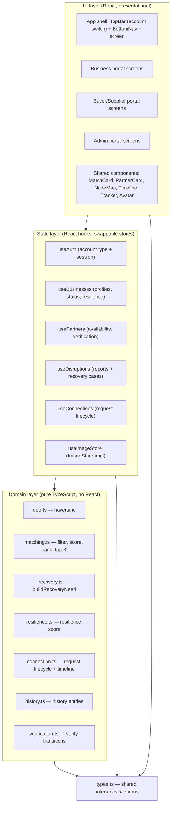
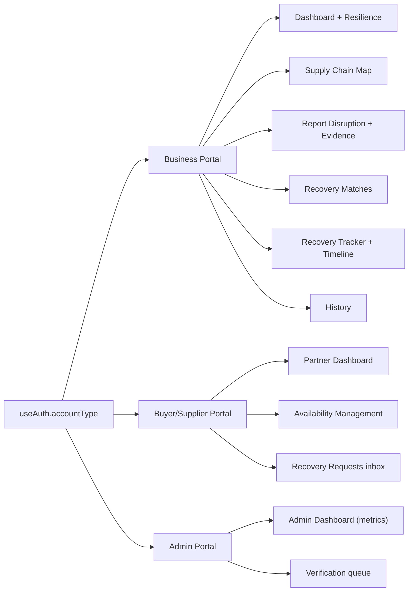

# Design Document

## Overview

Tuloy is a Disaster-Resilient Supply Chain Continuity Platform for coconut-industry SMEs in Mindanao. This design covers the MVP: one platform with three selectable account types (Business, Buyer/Supplier, Admin), each with its own portal, sharing one in-memory data layer and one mobile-app shell.

The core loop is unchanged from the requirements: a business registers → maps its supply chain → suffers a disruption → reports it (with evidence) → the matching engine ranks alternatives → the business requests a connection → the partner accepts → the supply chain is marked restored, tracked to completion, and logged to history.

This is a **client-side demo** with no backend. All state lives in React hooks. The design's central constraint (from the global coding standards, DIP) is that **all domain logic is expressed as pure, framework-free modules behind small interfaces**, so the in-memory stores can be swapped for a real API without touching UI or business logic. React components only render and dispatch; they contain no scoring, ranking, or lifecycle rules.

### Relationship to existing code

The repository already implements a large slice of this loop. This design **reuses** as much as possible and is explicit about the three buckets:

| Bucket | Items |
| --- | --- |
| **REUSED as-is** | Haversine distance (`geo.ts`), weighted-score matching shape and top-3 slice (`matching.ts`), the send/accept/reject lifecycle pattern (`orders.ts` + `useOrders.ts`), the mobile shell (`TopBar`, `BottomNav`, `.app`/`.screen` layout, design tokens in `index.css`), and presentational cards (`MatchCard`, `PartnerCard`, `OrderTimeline`, `Badge`). |
| **EXTENDED** | `Partner`/`BusinessProfile` gain images, precise coordinates, an `Availability_Status`, and `Verification_Status`; the matching weights change to the MVP's five criteria (Business Verification replaces the old Logistics/Reliability split); the `TopBar` role switch (`buyer`/`supplier`) becomes a three-way **account-type** switch that adds `admin`; the order lifecycle generalizes into `ConnectionRequest`. |
| **NEW** | Account types + mock authentication, business registration, the visual supply-chain node map, evidence image upload, the resilience score, the disaster event timeline, the recovery tracker, the supply-chain history log, and the entire Admin portal (dashboard metrics + verification workflow). |

### New must-have features (called out)

These extend the current requirements and are designed here for the first time:

- **Business Profile Image** — logo/farm/facility image on the business record and dashboard header.
- **Avatars** — every partner/business node and match card shows an image or a generated initials avatar fallback.
- **Visual Supply Chain Map** — node graph (supplier → business → buyer) rather than a list.
- **Evidence Image Upload** — an image attached to a disruption report.
- **Resilience Score** — a 0–100% health indicator computed from the business's current supply-chain state.
- **Disaster Event Timeline** — an ordered, dated event log for a disruption/recovery.
- **Recovery Tracker** — a five-step progress checklist for an accepted recovery.
- **Supply Chain History** — a dated log of sales, disruptions, replacements, and recoveries.

Image handling for the in-memory MVP uses in-session object/base64 data URLs behind a swappable `ImageStore` abstraction. Persistent document storage remains out of scope per the SRS; only lightweight in-session profile and evidence images are in scope.

## Architecture

### Layered architecture

The system keeps a strict dependency direction: **UI → state hooks → domain (pure) ← types**. Domain modules never import React; hooks never contain business rules; components never compute scores.



### Portals map to account types

One app, one shell, three portals selected by `Account_Type`. The existing `TopBar` role switch is generalized from `WorkspaceRole = "buyer" | "supplier"` to `AccountType = "business" | "partner" | "admin"`; `App.tsx`'s view state machine gains admin views and routes each account type to its own bottom-tab set.



### Access-control model (MVP)

Authentication is mocked but the account-type gate is real: `useAuth` holds the current session's `accountType`, and `App.tsx` only mounts screens permitted for that type. Any capability invoked without a session, or from the wrong account type, is refused by a single guard in the state layer (satisfies Requirement 1.4/1.5 at the demo level). This is a swap point: `useAuth` exposes an `AuthService` interface so a real token-based service can replace it.

## Components and Interfaces

Domain modules are pure and independently testable. Each state hook implements a small interface (ISP) so a real API client can be substituted (DIP/LSP).

### Domain interfaces

```typescript
// matching.ts — pure ranking (extended from existing)
export function scoreCandidate(partner: PartnerProfile, need: RecoveryNeed): MatchResult;
export function findAlternatives(partners: PartnerProfile[], need: RecoveryNeed): MatchResult[];

// recovery.ts — pure derivation (reused)
export function buildRecoveryNeed(
  business: BusinessProfile,
  affected: PartnerProfile,
  report: DisruptionReport
): RecoveryNeed;

// resilience.ts — pure computation (new)
export function computeResilienceScore(input: ResilienceInput): number; // 0..100

// connection.ts — pure lifecycle transitions (generalized from orders.ts)
export function createConnectionRequest(input: NewConnectionInput, now?: number): ConnectionRequest;
export function acceptRequest(req: ConnectionRequest, now?: number): ConnectionResult;
export function rejectRequest(req: ConnectionRequest, now?: number): ConnectionResult;

// history.ts — pure log building (new)
export function appendHistory(log: HistoryEntry[], entry: HistoryEntry): HistoryEntry[];

// verification.ts — pure transition (new)
export function verifyBusiness(profile: BusinessProfile, now?: number): BusinessProfile;
```

### State-layer interfaces (swappable stores)

```typescript
export interface AuthService {
  session: Session | null;
  signIn(credentials: Credentials): AuthOutcome; // ok | invalid-credentials
  signOut(): void;
  can(accountType: AccountType): boolean;
}

export interface BusinessStore {
  businesses: BusinessProfile[];
  register(input: RegistrationInput): RegistrationOutcome; // created | missing-fields
  updateProfile(id: string, patch: ProfilePatch): BusinessProfile;
  setStatus(id: string, status: BusinessStatus): BusinessProfile;
  getResilience(id: string): number;
}

export interface PartnerStore {
  partners: PartnerProfile[];
  setAvailability(id: string, status: AvailabilityStatus): PartnerProfile;
}

export interface DisruptionStore {
  reports: DisruptionReport[];
  cases: RecoveryCase[];
  report(input: DisruptionInput): DisruptionOutcome; // created | missing-fields
  markRecovered(caseId: string): void;
}

export interface ConnectionStore {
  requests: ConnectionRequest[];
  send(input: NewConnectionInput): ConnectionOutcome; // created | missing-fields
  accept(requestId: string): ConnectionResult;
  reject(requestId: string): ConnectionResult;
  incomingFor(partnerId: string): ConnectionRequest[]; // Pending only
}

export interface ImageStore {
  put(file: File | Blob): Promise<ImageRef>;   // returns a data/object URL ref
  get(ref: ImageRef): string | undefined;      // resolves to a src URL
  revoke(ref: ImageRef): void;
}
```

Every store returns a **typed outcome shape** (never throws to the caller), matching the global standard for predictable results and safe retries.

### Shared UI components

- **Reused**: `MatchCard` (extended to show an avatar + verification badge + criterion checklist), `PartnerCard`, `OrderTimeline` (reused for the disaster timeline), `Badge`, `TopBar`, `BottomNav`.
- **New**: `Avatar` (image ref with initials fallback), `SupplyChainMap` (SVG node graph), `ResilienceGauge`, `RecoveryTracker` (5-step checklist), `EvidenceUpload`, `ImageField`, `VerificationCard`, `MetricTile`.

## Data Models

All types live in `src/domain/types.ts` (extended). Enums are modeled as string-literal unions for zero-runtime-cost type safety.

### Enums / status unions

```typescript
export type AccountType = "business" | "partner" | "admin";

export type PartnerRole = "buyer" | "supplier";

export type BusinessType = "farmer" | "processor" | "trader" | "distributor";

export type ProductType =
  | "copra" | "coconut_oil" | "desiccated" | "coir" | "husk" | "coco_water";

/** MVP three-value availability, replacing the old disasterStatus/routeStatus pair. */
export type AvailabilityStatus = "available" | "limited" | "unavailable";

export type VerificationStatus = "unverified" | "verified";

export type BusinessStatus = "operating_normally" | "disrupted" | "recovering";

export type ProblemType = "buyer_unavailable" | "supplier_unavailable";

export type Urgency = "low" | "medium" | "high";

export type ConnectionStatus = "pending" | "accepted" | "rejected";

export type RecoveryStage =
  | "request_sent" | "accepted" | "logistics_confirmed"
  | "delivery_completed" | "transaction_completed";

export type HistoryKind =
  | "sale" | "disruption" | "replacement" | "recovery";
```

### Core records

```typescript
export interface GeoPoint { lat: number; lng: number; }
export interface Location extends GeoPoint { name: string; }

/** Region/Province/Municipality/Barangay administrative address + coordinates. */
export interface Address {
  region: string;
  province: string;
  municipality: string;
  barangay: string;
  point: GeoPoint;
}

/** Opaque reference to an in-session image resolved via ImageStore. */
export interface ImageRef { id: string; }

/** A buyer or supplier in the network (EXTENDED: image, availability, verification). */
export interface PartnerProfile {
  id: string;
  name: string;
  role: PartnerRole;
  image?: ImageRef;               // NEW: avatar/logo
  location: Location;
  products: ProductType[];
  capacityTons: number;           // monthly buying/supply capacity
  availability: AvailabilityStatus; // EXTENDED: replaces disasterStatus/routeStatus
  pricePhpPerTon: number;
  verification: VerificationStatus; // EXTENDED: was boolean `verified`
  rating: number;
  lastActiveAt: number;           // NEW: for node "last active" display
}

/** The registered SME (EXTENDED: owner, type, image, address, status, verification). */
export interface BusinessProfile {
  id: string;
  name: string;
  owner: string;                  // NEW
  businessType: BusinessType;     // NEW
  industry: "coconut";            // NEW (fixed for MVP)
  description: string;            // NEW
  image?: ImageRef;               // NEW: logo/farm/facility
  address: Address;               // EXTENDED: structured admin levels + coordinates
  location: Location;             // derived convenience {name, lat, lng}
  products: ProductType[];
  monthlyVolumeTons: number;
  status: BusinessStatus;         // NEW
  verification: VerificationStatus; // NEW
  supplyChain: SupplyChainRelationship[]; // EXTENDED: was currentPartners
  createdAt: number;
}

/** One mapped current relationship in the supply chain (NEW explicit type). */
export interface SupplyChainRelationship {
  id: string;
  partnerId: string;
  partnerName: string;
  partnerRole: PartnerRole;       // supplier feeds business; buyer consumes from business
  product: ProductType;
  location: Location;
  partnerImage?: ImageRef;
  status: AvailabilityStatus;     // node health for the map
  lastActiveAt: number;
}

/** A reported disruption (EXTENDED: reason, urgency, evidence image). */
export interface DisruptionReport {
  id: string;
  businessId: string;
  problemType: ProblemType;
  affectedPartnerId: string;
  reason: string;
  description: string;
  urgency: Urgency;
  evidence?: ImageRef;            // NEW: evidence image upload
  createdAt: number;
}

/** Structured need derived from a report (reused shape). */
export interface RecoveryNeed {
  problemType: ProblemType;
  neededRole: PartnerRole;
  product: ProductType;
  volumeTons: number;
  referencePricePhpPerTon: number;
  origin: GeoPoint;
  affectedPartnerId: string;
}

export interface CriterionScore {
  key: "distance" | "capacity" | "price" | "product" | "verification";
  label: string;
  score: number;   // 0..1 normalized
  detail: string;  // human-readable value for the checklist
}

export interface MatchResult {
  partner: PartnerProfile;
  total: number;         // 0..100 Match_Score
  distanceKm: number;
  criteria: CriterionScore[];
}

/** A connection request (GENERALIZED from Order). */
export interface ConnectionRequest {
  id: string;
  caseId: string;                 // links to the RecoveryCase it resolves
  businessId: string;
  businessName: string;
  partnerId: string;
  partnerName: string;
  product: ProductType;
  quantityTons: number;
  status: ConnectionStatus;
  createdAt: number;
  decidedAt?: number;
}

export interface TimelineEvent {
  at: number;
  label: string;
  kind: "disaster" | "report" | "recommendation" | "connection" | "recovery";
}

/** A recovery case ties a disruption to its request, tracker, and timeline (NEW). */
export interface RecoveryCase {
  id: string;
  businessId: string;
  reportId: string;
  need: RecoveryNeed;
  requestId?: string;
  stage: RecoveryStage;           // recovery tracker position
  recovered: boolean;
  timeline: TimelineEvent[];      // disaster event timeline
  createdAt: number;
}

/** A dated supply-chain history record (NEW). */
export interface HistoryEntry {
  id: string;
  businessId: string;
  kind: HistoryKind;
  at: number;
  summary: string;
  partnerName?: string;
  product?: ProductType;
  quantityTons?: number;
}

/** Input to the resilience score computation (NEW). */
export interface ResilienceInput {
  status: BusinessStatus;
  relationships: SupplyChainRelationship[];
  activeDisruptions: number;
  verified: boolean;
}
```

## Matching Engine

The engine reuses the existing structure of `findAlternatives` (filter → score → rank → slice) but implements the **exact MVP criteria and weights** from Requirement 6, replacing the legacy Logistics/Reliability weights.

### Weights (fixed, sum to 100)

```typescript
const WEIGHTS = {
  distance: 0.40,      // Distance 40%
  capacity: 0.25,      // Capacity Availability 25%
  price: 0.15,         // Price Competitiveness 15%
  product: 0.10,       // Product Compatibility 10%
  verification: 0.10,  // Business Verification 10%
} as const;
```

### Hard filters (applied before scoring)

A candidate is considered only if **all** hold (Req 6.1–6.4):
1. `partner.role === need.neededRole`
2. `partner.products.includes(need.product)` (offers/accepts the product)
3. `partner.availability !== "unavailable"`
4. `partner.id !== need.affectedPartnerId`

### Criterion sub-scores (each normalized to 0..1, higher = better)

- **Distance**: `clamp01(1 - km / MAX_USEFUL_DISTANCE_KM)` where `km` is haversine distance from `need.origin`. Nearer scores higher.
- **Capacity**: `clamp01(partner.capacityTons / need.volumeTons)` (if `volumeTons === 0`, score `1`). Greater capacity scores higher, capped at full coverage. `available` and `limited` both pass the filter; `limited` partners typically have lower `capacityTons`, so capacity naturally reflects availability.
- **Price**: fairness relative to reference price. For a needed **buyer**, higher offer is better: `clamp01(partner.pricePhpPerTon / ref)`. For a needed **supplier**, lower ask is better: `clamp01(ref / partner.pricePhpPerTon)`. Price closest to (or better than) the fair reference scores near 1.
- **Product Compatibility**: `1` when the product matches (guaranteed by the filter for the primary product), scaled by breadth of overlap if multiple products are relevant; full match = 1, no match = 0.
- **Verification**: `partner.verification === "verified" ? 1 : 0.5`. Verified scores strictly higher than unverified (Req 6.6, 12.4), while unverified partners are not excluded.

### Score, rank, tie-break, top-3

```
total = round( 100 * Σ (weight[k] * subScore[k]) )   // integer 0..100  (Req 6.7)
```

- Rank descending by `total` (Req 6.8).
- **Tie-break** (Req 6.9): equal `total` → shorter `distanceKm` first → then greater `capacityTons` first. Implemented as a stable multi-key comparator.
- Return the top 3 when more than three remain; return all (ranked) when three or fewer; return an empty set with a "no alternatives" indicator when none remain (Req 6.10–6.12).

Because each sub-score is in `[0,1]` and weights sum to 1, `total` is provably in `[0,100]`.

## Resilience Score

A pure function producing an integer 0–100% shown on the business dashboard. It is a weighted blend of operational signals, all derived from current in-memory state (no history required):

```
base by status:      operating_normally = 100, recovering = 60, disrupted = 30
healthyLinkRatio =   (# relationships with status "available") / max(1, # relationships)
disruptionPenalty =  min(30, activeDisruptions * 15)
verificationBonus =  verified ? 5 : 0

resilience = clamp(0, 100, round(
    0.6 * base
  + 0.4 * (100 * healthyLinkRatio)
  - disruptionPenalty
  + verificationBonus
))
```

Rationale: operational status dominates, but a business with many healthy mapped links is more resilient than one with a single fragile link; active disruptions reduce the score; verification is a small trust bonus. The function is monotonic — adding a healthy relationship or clearing a disruption never decreases the score, and adding a disruption never increases it — which is a testable property.

## State Management Approach

- All state is in-memory via React hooks, seeded from `mockData.ts` (extended with images, coordinates, availability, verification).
- Each hook wraps a domain module and exposes one of the **store interfaces** above. Hooks own *state and orchestration*; domain modules own *rules*. This keeps components thin and the rules unit-testable in isolation.
- Stores are provided once at the app root and passed down (or via a small context) so the Business, Partner, and Admin portals observe the **same** data — e.g., a partner accepting a request in the Partner portal flips the business's recovery case to Recovered and updates the Admin metrics, mirroring the existing shared `useOrders` pattern.
- **Swap point**: because components depend only on the store interfaces, replacing `useConnections` (in-memory) with an API-backed implementation requires no UI change (DIP/LSP).

## Screen / Navigation Map

The shell stays: sticky `TopBar` (now with the three-way account switch), scrollable `.screen`, and a per-portal `BottomNav`.

**Business Portal** (tabs: Home · Chain · Recover · History)
- Dashboard (image header, status, resilience gauge, cards: Supply Chain Status, Active Disruptions, Quick Actions) → Report Disruption / Find Partner / Update Availability / View History
- Supply Chain Map (visual node graph) 
- Report Disruption (problem type, affected partner filtered by role, reason, description, urgency, evidence upload)
- Recovery Matches (top-3 cards) → Recovery Tracker + Disaster Timeline
- History

**Buyer/Supplier Portal** (tabs: Home · Availability · Requests)
- Partner Dashboard
- Availability Management (Available/Limited/Unavailable + capacity)
- Recovery Requests inbox (Accept/Reject pending requests)

**Admin Portal** (tabs: Dashboard · Verify)
- Admin Dashboard (metric tiles: registered businesses, verified partners, active disruptions, successful recoveries)
- Verification queue (review image, details, location, products, contact → Verify)

Registration and Sign-in are pre-portal screens gated by `useAuth`.

## Image Handling Approach

- Images are held in-session behind the `ImageStore` interface. The MVP implementation (`objectUrlImageStore`) accepts a `File`/`Blob`, creates an object URL (or base64 data URL for seeded mock images), and returns an `ImageRef`. `get(ref)` resolves to a `src` string for ``; `revoke(ref)` frees object URLs on unmount.
- Components never touch the storage mechanism — they receive an `ImageRef` and render via the `Avatar`/`ImageField` components, which resolve through the store. This is the swap point for real object storage (e.g., S3) later.
- `Avatar` falls back to generated initials + a deterministic brand-tinted background when no `ImageRef` is present, so the UI never shows a broken image.
- Validation: only `image/*` types under a size cap are accepted; rejected files return a typed error and preserve the form. Persistent document storage stays out of scope; only in-session profile and evidence images are retained, and they are lost on refresh (acceptable for the demo).

## Correctness Properties

*A property is a characteristic or behavior that should hold true across all valid executions of a system — essentially, a formal statement about what the system should do. Properties serve as the bridge between human-readable specifications and machine-verifiable correctness guarantees.*

These properties target the pure domain modules (matching engine, recovery-need derivation, connection lifecycle, resilience score, history log, validation, and image round-trip). Each is written for property-based testing over generated inputs. UI rendering, mock authentication, and simple aggregate counts are covered by example/edge tests in the Testing Strategy instead.

### Property 1: Creation invariants

*For any* valid registration input, the created Business_Account has `verification === "unverified"` and `status === "operating_normally"`.

**Validates: Requirements 2.3, 2.4**

### Property 2: Registration validation

*For any* registration input in which at least one required field (Business Name, Owner, Location, Industry, Business Type, Products) is blank, the Registration_Service returns a missing-fields outcome that lists exactly the blank required fields and preserves every submitted value unchanged.

**Validates: Requirements 2.2**

### Property 3: Profile update fidelity

*For any* business profile and any valid patch to products or monthly capacity, reading the profile after `updateProfile` reflects the patched values and leaves all other fields unchanged.

**Validates: Requirements 3.2**

### Property 4: Affected-partner role restriction

*For any* business Supply_Chain_Profile, the set of selectable affected partners for a given Problem_Type equals exactly the mapped partners whose role matches that Problem_Type (buyers for Buyer Unavailable, suppliers for Supplier Unavailable).

**Validates: Requirements 5.4, 5.5**

### Property 5: Disruption-report validation

*For any* disruption-report input in which at least one required field (Problem_Type, Affected Partner, Reason, Urgency) is missing, the Disruption_Reporter returns a missing-fields outcome that lists exactly the missing fields and preserves the submitted values.

**Validates: Requirements 5.6**

### Property 6: Recovery-need derivation

*For any* business, affected partner, and Problem_Type, the derived Recovery_Need has a `neededRole` matching the Problem_Type, a `product` shared by the business and partner (or the defined fallback), `volumeTons` equal to the business's monthly volume, and `affectedPartnerId` set to the affected partner.

**Validates: Requirements 5.7**

### Property 7: Reporting disrupts the business

*For any* successfully created Disruption_Report, the reporting business's Business_Status becomes Disrupted.

**Validates: Requirements 5.8**

### Property 8: Matching filters

*For any* set of partners and any Recovery_Need, every returned Match_Result satisfies all filters simultaneously: its role equals `need.neededRole`, it offers/accepts `need.product`, its Availability_Status is not Unavailable, and its id is not the affected partner's id.

**Validates: Requirements 6.1, 6.2, 6.3, 6.4, 8.4**

### Property 9: Match score is a bounded integer weighted sum

*For any* candidate partner and Recovery_Need, the Match_Score is an integer in `[0, 100]` equal to `round(100 × Σ(weightₖ × subScoreₖ))`, where the five weights (Distance 0.40, Capacity 0.25, Price 0.15, Product 0.10, Verification 0.10) sum to 1 and each sub-score lies in `[0, 1]`.

**Validates: Requirements 6.5, 6.7**

### Property 10: Criterion monotonic direction

*For any* two candidates that are identical except in one criterion, the candidate that is "better" on that criterion has a sub-score greater than or equal to the other's: nearer Distance, greater Capacity, Price closer to the fair reference, full Product match (1 vs 0), and Verified (> Unverified).

**Validates: Requirements 6.6, 12.4**

### Property 11: Ranking and tie-break ordering

*For any* returned list of Match_Results, the list is ordered by Match_Score descending, and any two entries with equal Match_Score are ordered by shorter Distance first and then by greater Capacity first.

**Validates: Requirements 6.8, 6.9**

### Property 12: Result-set size

*For any* set of partners and Recovery_Need, the number of returned Match_Results equals `min(3, eligibleCount)`, where `eligibleCount` is the number of partners passing all filters; when `eligibleCount` is 0 the result is empty.

**Validates: Requirements 6.10, 6.11, 6.12**

### Property 13: Connection-request validation

*For any* connection-request input in which at least one of partner, product, or quantity is missing, the Connection_Service returns a missing-fields outcome that lists exactly the missing fields and preserves the submitted values.

**Validates: Requirements 7.2**

### Property 14: New requests are pending

*For any* successfully created Connection_Request, its status is Pending.

**Validates: Requirements 7.3**

### Property 15: Accept/reject transitions

*For any* Pending Connection_Request, accepting it yields status Accepted and rejecting it yields status Rejected.

**Validates: Requirements 7.4, 7.5**

### Property 16: Accepted request records the relationship

*For any* Connection_Request that becomes Accepted, the requesting business's Supply_Chain_Profile afterwards contains a relationship to that partner for the requested product.

**Validates: Requirements 7.6**

### Property 17: Decision idempotence (no double decide)

*For any* Connection_Request, applying accept or reject a second time preserves the first decision: the status does not change and the operation reports the request as already decided.

**Validates: Requirements 7.7**

### Property 18: Availability set/read round trip

*For any* partner and any Availability_Status value, after `setAvailability` the partner's stored Availability_Status equals the value that was set.

**Validates: Requirements 8.1, 8.2**

### Property 19: Incoming-requests query

*For any* set of Connection_Requests and any partner, `incomingFor(partner)` returns exactly the requests addressed to that partner whose status is Pending.

**Validates: Requirements 9.1**

### Property 20: Recovered if and only if an accepted request exists

*For any* RecoveryCase, the case is marked Recovered exactly when an Accepted Connection_Request exists for it; when recovered, the associated business's Business_Status is Operating Normally, and while no accepted request exists the case is Pending Recovery.

**Validates: Requirements 10.2, 10.3, 10.4**

### Property 21: Verification transition idempotence

*For any* business, `verifyBusiness` results in `verification === "verified"`, and applying it again leaves the business Verified (idempotent).

**Validates: Requirements 12.2**

### Property 22: Resilience score is bounded and monotonic

*For any* ResilienceInput, the resilience score is an integer in `[0, 100]`; adding a healthy relationship or reducing the active-disruption count never decreases the score, and adding an active disruption never increases it.

New Feature: Resilience Score shown on dashboard.

**Validates: Requirements 3.1**

### Property 23: Image store round trip

*For any* accepted image, `get(put(image))` resolves to a defined source reference, so a stored profile or evidence image can always be retrieved for display within the session.

New Feature: Business Profile Image / Evidence Image Upload.

**Validates: Requirements 3.1, 5.1**

### Property 24: History append ordering

*For any* history log and any new entry, `appendHistory` retains all previously recorded entries and returns a log ordered chronologically by timestamp.

New Feature: Supply Chain History.

**Validates: Requirements 10.1**

## Error Handling

The system follows the global standard: **no domain function or store throws to a UI caller**; every operation returns a typed, discriminated outcome the UI can render predictably.

- **Validation errors** (registration, disruption report, connection request, image upload): return `{ ok: false, kind: "missing-fields", missing: string[], values: SubmittedValues }` (or `"invalid-image"`), so the form re-renders with fields preserved and errors highlighted (Req 2.2, 5.6, 7.2).
- **Authentication errors**: `signIn` returns `{ ok: false, kind: "invalid-credentials" }`; guarded capabilities invoked without/with wrong session return `{ ok: false, kind: "forbidden" }` (Req 1.3–1.5).
- **Lifecycle guards**: accepting/rejecting an already-decided request returns `{ ok: false, kind: "already-decided", status }` rather than mutating (Req 7.7).
- **Empty match set**: `findAlternatives` returns `[]`; the Recovery Matches screen shows a clear "no alternatives available" empty state (Req 6.12).
- **Missing images**: `ImageStore.get` returning `undefined` triggers the `Avatar` initials fallback; never a broken image.
- **Unknown ids**: store getters return `undefined` and callers render an empty/not-found state; no throw.
- **Boundary math**: sub-scores use `clamp01`; capacity divides guard against `volumeTons === 0`; price guards against non-positive reference/ask prices, keeping Match_Score provably within `[0, 100]`.

## Testing Strategy

### Dual approach

- **Unit / example tests** cover concrete behavior, enumerated acceptance, UI view-model shape, mock auth, and aggregate counts: Req 1.1–1.5, 2.1, 3.1/3.3/3.4, 4.1/4.2/4.4, 5.1/5.2/5.3, 6.13, 8.1/8.3, 9.2/9.3/9.4, 10.1, 11.1–11.5, 12.1/12.3, and edge cases (empty match set, no-session guard, invalid/oversize image).
- **Property-based tests** cover the 24 correctness properties above — the pure, input-varying logic in `matching.ts`, `recovery.ts`, `connection.ts`, `resilience.ts`, `history.ts`, the validators, and `ImageStore`.

Together these give comprehensive coverage: example tests pin down specific scenarios and rendering; property tests verify universal correctness of the engine and lifecycle across generated inputs.

### Tooling

No test runner exists yet (`package.json` only runs `tsc --noEmit`). Because the stack is Vite + React + TypeScript, the design adopts:

- **Vitest** as the test runner (native Vite integration, TS-first).
- **fast-check** as the property-based testing library. Property tests MUST NOT be hand-rolled — use fast-check `arbitraries` to generate partners, business profiles, supply chains, recovery needs, requests, and resilience inputs.
- **@testing-library/react** for the small set of view-model/rendering example tests.

Add scripts: `"test": "vitest run"` and `"test:watch": "vitest"`. Run single-execution with `vitest run` (never watch mode in automation).

### Property test configuration

- Each property test runs a **minimum of 100 iterations** (`fc.assert(fc.property(...), { numRuns: 100 })`).
- Each property test is implemented as a **single** property and tagged with a comment referencing its design property, in the format:
  - `// Feature: tuloy-mvp, Property {number}: {property_text}`
- Custom arbitraries live in a shared `test/arbitraries.ts` so generators (valid coordinates within Mindanao bounds, product sets, capacities, prices, availability, verification) are reused across properties.

### Test organization

- `src/domain/*.test.ts` — property + unit tests for pure modules (matching, recovery, connection, resilience, history, verification).
- `src/state/*.test.ts` — store round-trip and lifecycle integration tests using in-memory implementations.
- `src/ui/*.test.tsx` — a small number of view-model/rendering example tests.

### Key generators (fast-check arbitraries)

- `partnerArb` — random `PartnerProfile` with role, products, capacity, price, availability, verification, coordinates.
- `recoveryNeedArb` — consistent need (role, product, volume, reference price, origin).
- `supplyChainArb` — mixed buyers/suppliers for role-restriction and history properties.
- `connectionRequestArb` — requests in each status for lifecycle/idempotence properties.
- `resilienceInputArb` — status, relationships, active-disruption counts, verification for bounded/monotonic checks.
